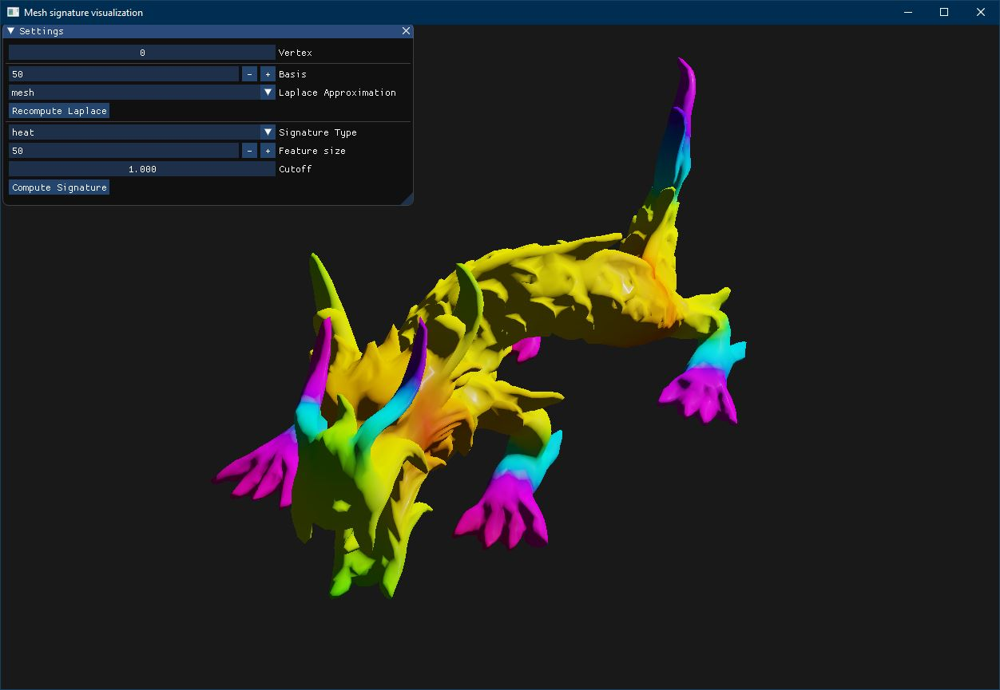

# Mesh Signatures
This is a small project implementing mesh signatures for triangle meshes in python.
We currently implement two signatures:
- Heat-Kernel-Signature
- Wave-Kernel-Signature

## Signature extractor

The core functionality is implemented in the two files [signature.py](signature.py) and [laplace.py](laplace.py).  Both heat and wave signatures are require the eigenvectors and eigenvalues of the generalized eigenvector problem
, where  is the Laplace operator defined on the triangle mesh. 

***A*** is a diagonal matrix with areas associated with the area of vertices. ***W*** defines the approximation of the laplace operator (see next section).

You can easily compute the signatures of every vertex in a mesh like this:
```python
import trimesh

mesh = trimesh.load("./dragon.obj")
# Compute 100 eigen vectors using laplace-beltrami
extractor = SignatureExtractor(mesh, 100, approx='beltrami') 
# extractor = SignatureExtractor(path="./dragon.npz")

extractor.save("./dragon.npz") # Store eigen spectrum

# Compute 128 dimensional wave features
wave_fs = extractor.signatures(128, 'wave')

# Compute 64 dimensional heat features and get time values
heat_fs, ts = extractor.signatures(64, 'heat', return_x_ticks=True)
 
```

## Discrete Laplace Operator Approximations

An important part of mesh signatures is an approximation of the laplace operator matrix on the triangular mesh (V, E).
We implement 4 different versions of this.
- Laplace-Beltrami Matrix
- Cotangens Weighted Matrix
- Mesh Laplace Matrix
- Quadratic FEM

## Visualization

We provide a simple visualization, using OpenGL, to play with in the file [viz.py](viz.py)

You can use this like this:
```
python ./viz.py <path_to_mesh>
```
There is a list of optional parameters:
- **--n_basis**: Number of eigen values and vectors to compute
- **--f_size**:  Feature size to use
- **--approx**:  Laplace approximation to use. Must be one of *beltrami*, *cotangens*, *mesh* or *fem*
- **--kernel**:  Feature type to display. Must be one of *heat* or *wave* 
- **--laplace**: A .npz file containing precomputed eigen values and vectors. 

You can use [compute_laplace_spectrum.py](compute_laplace_spectrum.py) to create these files.

## Using the Laplace Operator spectrum

The signature extractor class computes the spectrum of the laplace operator. You can use the spectrum for spectral analysis on meshes.
We provide an example of this in [hamiltonian.py](hamiltonian.py) where we visualize the spectrum 
of the hamiltonian operator on a given masked mesh.

See [Hamiltonian operator for spectral shape analysis](http://arxiv.org/abs/1611.01990) by Yoni Choukroun et al. for details on the hamiltonian operator.

## Required packages
The core signature computation requires:
- [numpy](https://numpy.org/s) and [scipy](https://www.scipy.org/) for signature computation
- [trimesh](https://github.com/mikedh/trimesh) for MeshIO
- [lapy](https://github.com/Deep-MI/LaPy) (optional) for fem laplace approximation

The visualization script requieres
- [pyopengl](http://pyopengl.sourceforge.net/)
- [pyGLFW](https://github.com/FlorianRhiem/pyGLFW)
- [pyimgui](https://github.com/swistakm/pyimgui)
- [imgui_datascience](https://github.com/pthom/imgui_datascience) (only used in [hamiltonian.py](hamiltonian.py))
- [matplotlib](https://matplotlib.org/)

## References
- [A Concise and Provably Informative Multi-Scale Signature Based on Heat Diffusion](http://www.lix.polytechnique.fr/~maks/papers/hks.pdf), *Jian Sun et al.*
- [The Wave Kernel Signature: A Quantum Mechanical Approach to Shape Analysis](https://vision.informatik.tu-muenchen.de/_media/spezial/bib/aubry-et-al-4dmod11.pdf), *Mathieu Aubry et al.*
- [Pose-Consistent 3D Shape Segmentation Based on a Quantum Mechanical Feature Descriptor](http://imagine.enpc.fr/~aubrym/projects/wks/texts/2011-3D-shape-segmentation.pdf), *Mathieu Aubry et al.*
- [Discrete Laplace Operator on Meshed Surfaces](http://www.cs.jhu.edu/~misha/Fall09/Belkin08.pdf), *Mikhail Belkin et al.*
- [Laplace-Beltrami spectra as 'Shape-DNA' of surfaces and solids](http://dx.doi.org/10.1016/j.cad.2005.10.011), *Reuter M et al.*